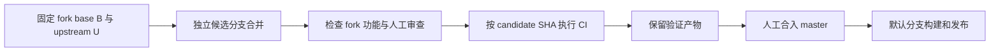

# 上游同步与候选构建

本文记录本 fork 的修复边界、已经实现的候选构建行为，以及后续
`Sync-Upstream` 的替代设计。长期同步流程仍处于设计阶段，当前没有切换
`.github/workflows/sync-upstream.yml` 的执行方式。

## 修复边界

本 fork 修复自己的配置、构建和发布逻辑。当前上游缺陷与历史同步导入的
上游缺陷继续跟踪，等待上游解决，不在本 fork 增加 driver 或升级框架补丁。

| 项目 | 当前处理 |
| --- | --- |
| Airoha reset 未初始化变量、YT921x RX 所有权、Nokia stock 环境 helper | 保留上游实现，跟踪上游修复 |
| 历史导入的 Airoha FIT 升级调用、Gemtek 默认 U-Boot 命令 | 保留现状，等待对应上游实现修复 |
| Gemtek PCIe x2 与新 API 的等价性、binding | 继续记录待验证；本轮没有加入寄存器 workaround |
| AN7583 默认 EIP93 选择 | 补齐 fork 配置需要的 `CONFIG_CRYPTO_HW`，不修改 driver |
| profile 中已经不存在的 `trojan-plus` 选择 | 删除失效的 fork 配置项，不恢复上游已删除的 package |
| 指定源码 SHA 的候选构建和发布归属 | 使用实际 checkout SHA；候选构建上传 Actions artifacts |

上游问题按审查过的 `8e6869b60` 和后续远端快照 `f820e495d` 登记：Airoha
reset／Nokia helper 来自 `351ec9813`，YT921x 来自 `14590b681`，历史导入项
来自 `18ce6f116`。后续跟踪上游修复提交，不在本 fork 维护这些修复的副本。

fork 修复验收和上游问题跟踪分开；已经明确延期的上游缺陷继续登记。完整
x86 CI 的结论仅适用于该 profile，受影响的 Airoha、Rockchip 硬件行为仍需在
上游修复后验证，不能写成“已通过实机验证”。

## 已实现的 OpenWrt-CI 行为

工作流仍由 `workflow_dispatch` 触发，`source_sha` 接受完整的 40 位 commit
SHA。留空时使用 dispatch ref 对应的事件 SHA，checkout 不依赖执行期间可能
移动的分支名。

源码校验 helper 从 `github.workflow_sha` 对应的提交取出，保存到 runner 临时
目录。这样也可以验证尚未包含该 helper 的历史源码提交。helper 不修改 Git
引用，检查 HEAD 与请求的 SHA 一致，并输出完整 SHA 和 12 位短 SHA。

固件 metadata 和 release target 使用实际源码 SHA，同时单独记录 workflow
commit、dispatch commit 和 workflow ref。

只有同时满足以下条件才发布 history/latest release 或清理历史 release：

1. workflow 是从仓库默认分支 dispatch 的；
2. 构建完成、发布前重新 fetch 默认分支后，实际源码 SHA 仍等于它的 HEAD。

候选分支、tag、历史 SHA，以及构建期间默认分支已经前进的运行，均保留为
Actions artifacts，保留期为 14 天，不执行 release 或 tag 写入。

### 校验 reconciliation 候选

先将修复后的候选提交发布到候选分支，再选择该分支上的工作流版本运行。
默认分支尚未包含工作流修复时，必须使用包含修复的候选 workflow ref。

```sh
gh workflow run openwrt-ci.yml \
  --ref sync/upstream-reconcile \
  -f source_sha="$(git rev-parse sync/upstream-reconcile)" \
  -f build_reason=reconciliation-review
```

运行时必须核对 checkout SHA、构建结果和 artifact metadata 中的 `Commit`。
GitHub 的 `GITHUB_SHA` 标识 dispatch ref 的提交，不能替代用户请求的源码 SHA。

### 本地回归验证

需要 Python 3、PyYAML、Git 和 Bash：

```sh
python3 -B -m unittest discover -s scripts/tests -v
```

测试使用临时 Git 仓库，覆盖 merge commit、候选分支、历史 SHA、默认分支
在构建期间前进、checkout 不符，以及产物 metadata 的来源。它们不会推送
远端或执行固件编译。

## 后续 Sync-Upstream 设计

现有同步工作流采用“合入并推送 master，再触发构建”。替代设计将顺序改为
“准备候选、审查、CI、人工合入、默认分支发布”，在第一阶段稳定后再实施。



### 候选的身份和历史

- 一次同步固定默认分支 SHA `B`、上游 SHA `U` 和 merge-base；产生候选后再
  记录 `candidate_sha`。三个 SHA 均使用完整值。
- 使用带 base/upstream SHA 的独立候选分支，避免覆盖正在审查的候选或手工
  修复。已有候选复用时必须核对它的 SHA，不能按分支名猜测构建来源。
- 后续实现以 `.github/upstream-state.json` 记录已确认的上游仓库、上游 SHA
  和 fork base SHA。候选自身的 SHA 记录在 PR/CI metadata 中，避免自引用。
- 若上次确认的上游 SHA 不再是新上游的祖先，停止自动处理，转为历史审查。
  不通过 reset fork、强推 master 或丢弃旧父链来“同步”历史改写。
- 合并只在候选分支执行；发生冲突时停止，不自动采用 ours/theirs，不覆盖
  默认分支。

### 审查与验证

- 对比 base、旧 fork、上游和候选的树，维护 fork 功能映射；不能只统计
  conflict，也不能用 commit 仍在历史中证明设备支持仍在。
- 配置检查覆盖实际生成的配置和 package provider，识别 profile 选择被
  `defconfig` 静默丢弃的情况。
- 根据改动范围验证 patch series、DTS/image/upgrade 对应关系。上游已知
  问题单独记录首次出现的提交、受影响平台和修复进度；本 fork 不附加修复。
- 审查通过后，对精确 `candidate_sha` 执行完整 `x86_64-passwall-docker` CI。
  dispatch 成功、job 被跳过或某个同名 workflow 成功都不算验证通过。
- 同步调度器需要保存关联的 workflow run ID，并核对 metadata 的源码 SHA；
  不能只用 workflow run 的 `head_sha` 判断 `source_sha` 构建的是谁。

### 合入与发布

- 工作流不直接推送 master，不自动合入 PR。人工确认审查与 CI 对应同一
  候选 SHA 后再合入。
- 默认分支在审查期间前进时，重新准备候选并重复必要验证，不沿用过期的
  base 和 CI 结果。
- 合入后在默认分支执行发布构建。若合入产生了新的 merge SHA，发布记录
  使用这个实际构建 SHA。
- 候选构建始终不修改 `latest`；正式发布继续保留当前 history release 和
  30 天历史清理机制。
- 权限按阶段拆分：检查读取代码，候选创建才写分支／PR，调度才写 Actions，
  正式发布才写 release。新的定时同步在该流程验证后启用。

## 技术依据

- [GitHub workflow_dispatch 的 ref/SHA 语义](https://docs.github.com/en/actions/reference/workflows-and-actions/events-that-trigger-workflows#workflow_dispatch)
- [GitHub workflow_sha context](https://docs.github.com/en/actions/reference/workflows-and-actions/contexts#github-context)
- [upload-artifact v7 使用方式与保留期](https://github.com/actions/upload-artifact/tree/v7)
